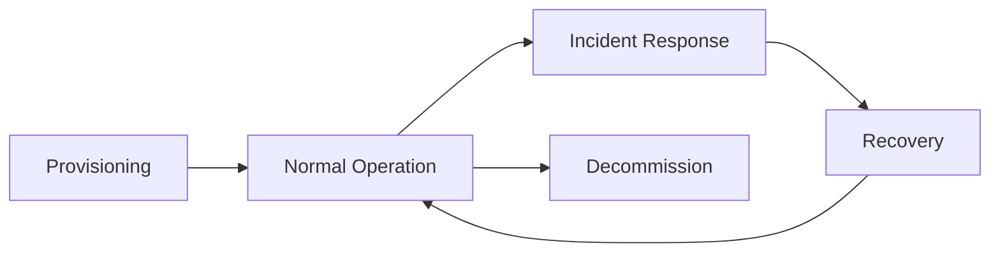

# PRISM Security Model

PRISM implements a defense-in-depth security architecture combining:
- **Biometric authentication** (fingerprint + face modalities)
- **Fuzzy commitment cryptography** for template protection
- **Blockchain anchoring** for identity immutability
- **Per-user encryption** for data isolation

## Key Hierarchy

```text
DEVICE_ROOT_KEY (TPM-bound in production)
    ├── wallet_seed = HKDF(root, "PRISM:wallet", salt=node_ip) → Per-node TX signing
    ├── master_seed = HKDF(root, "PRISM:master_seed")          → User key derivation 
    └── swarm_key   = HKDF(root, "PRISM:swarm")                → IPFS network
master_seed (kiosk only)
    └── user_key = HKDF(master_seed, user_did)                 → Per-user encryption
```

### Personal Device Binding
- Personal devices receive **only** their `owner_key` (pre-computed)
- Cannot derive other users' keys
- Enforced by the cluster deployment configuration

## Encryption Architecture

### Per-User Encryption
Each user's IPFS profile CID is encrypted with a unique key:
```python
user_key = HKDF(master_seed, user_did)
encrypted_cid = Fernet(user_key).encrypt(cid)
```

### Data Isolation
- **Kiosk**: Can decrypt any user's data (has `master_seed`)
- **Personal Device**: Can only decrypt owner's data (has `owner_key`)
- **Attacker**: Cannot decrypt without key derivation secret

## Access Control Matrix

| Role / Capability | Consensus Node Mgmt | Device Privileges | Credential Enroll | Credential Reissue | Credential Revoke | Attendance Record |
|:---|:---:|:---:|:---:|:---:|:---:|:---:|
| **Owner** | Add/Remove/Ban | Grant/Revoke Managers | Authorized | Authorized[^1] | Authorized | Authorized |
| **Manager** | Add/Remove/Ban | Grant/Revoke Flags | Authorized[^2] | Authorized[^2] | Authorized | Authorized[^2] |
| **Kiosk (`canEnroll` & `canRecord`)** | Denied | Denied | Authorized | Denied | Denied | Authorized |
| **Remote Client (`canRecord`)** | Denied | Denied | Denied | Denied | Denied | Authorized |
| **User (Remote Self)** | Denied | Denied | Denied | Provides Consent Only | Request Only | Authorized[^3] |
| **Unauthenticated / Banned** | Denied | Denied | Denied | Denied | Denied | Denied |

Edge devices must be registered in `Permissions.sol` and explicitly linked to an enode in `Registry.sol` before receiving application-layer capability flags.

[^1]: With consent from user via cryptographic signing using the user's private key.
[^2]: Only if the corresponding capability flag has been explicitly granted by the Owner or another Manager.
[^3]: For Self
## Audit Trail

All security-critical operations emit on-chain events natively from the smart contracts.

| Component | Event | Parameters | Trigger |
|:----------|:------|:-----------|:--------|
| **Registry.sol** | `UserEnrolled` | `user, did, infoCID` | New identity enrolled |
| | `UserReissued` | `user, reissuer, did, infoCID` | Credential reissued with consent |
| | `StatusChanged` | `user, active` | Profile activated or deactivated |
| | `RevocationRequested` | `user, requester` | Revocation initiated |
| | `RevocationFinalized` | `user, finalizer` | Revocation completed (consent or grace period) |
| | `RevocationCancelled` | `user, canceller` | Pending revocation cancelled |
| | `UserBanned` | `user, admin` | Permanent user ban |
| | `UserSuspended` | `user, suspender, reason` | Temporary user suspension |
| | `UserReinstated` | `user, reinstater` | User suspension lifted |
| | `DeviceSuspended` | `device, reason` | Device temporarily suspended |
| | `DeviceReinstated` | `device` | Device suspension lifted |
| | `DeviceBanned` | `device, admin` | Permanent device ban |
| | `KioskEnodeRevoked` | `device, enodeHash, revoker` | Kiosk enode unlinked |
| | `RoleChanged` | `actor, role, status` | Capability flag toggled |
| | `EmergencyStop` | `status` | System pause toggled |
| | `OwnershipTransferred` | `previousOwner, newOwner` | Contract ownership transferred |
| **Attendance.sol** | `Logged` | `user, did, infoCID, time, onSite, status` | Attendance recorded |
| **Permissions.sol**| `NodeAdded` | `enodeHash, enode` | Validator node Authorized |
| | `NodeRemoved` | `enodeHash` | Validator node deAuthorized |
| | `NodeBanned` | `enodeHash, admin` | Validator node permanently banned |
| | `AdminChanged` | `oldAdmin, newAdmin` | Permissions admin transferred |

## Operational Metadata Policy

To ensure system accountability without compromising biometric privacy, PRISM's `Registry` and `Attendance` contracts log the following **non-PII metadata** on-chain:

| Metadata Item | Source Profile / Event | Description |
|:--------------|:--------|:-----------|
| `address` | Submitting Wallet | The Ethereum address of the user or the submitting kiosk. |
| `did` | User Profile | Decentralized Identifier string representing the enrolled identity. |
| `infoCID` | IPFS Pointer | The encrypted IPFS blob containing the actual biometric data. |
| `timestamp` | Block Time | The standard block timestamp recorded natively at the moment of the transaction. |
| `onSite` | Auth Context | A boolean derived from `canRecord(msg.sender)`. Always `true` at emission — unAuthorized devices cause the transaction to revert. |
| `status` | Auth Event | A string representing the success or failure reason of the verification attempt. |

Biometric templates and raw sensor inputs are **NEVER** logged to the database, emitted in smart contract events, or exposed in metadata.

## Privileged Visibility

While the blockchain ledger is public, identity data remains private via strong per-user encryption. Access to the decrypted data is strictly stratified based on actors' capabilities:

| Actor | Visibility Scope | Off-Chain Decryption Capability |
|:------|:-----------------|:----------------------|
| **Standard Nodes** | Public blockchain records (DIDs, CIDs, Timestamps, Auth Status) | **None** (See only opaque CIDs) |
| **Personal Devices** | Owner's public records + Owner's IPFS profile | **ONLY** Owner's profile (Possesses the `owner_key` derived during linkage) |
| **Admin / Kiosks** | All public records + ALL IPFS profiles | **ALL** profiles (Possesses the `master_seed` to dynamically derive any `user_key` on demand) |

---

## Threat Model

**Scope**: 4-node QBFT prototype with personal device oracles  
**Architecture**: Kiosks = Validators + IPFS nodes (no external IPFS)

### 1. Assets

| Asset | Location | Confidentiality | Integrity | Availability |
|:------|:---------|:----------------|:----------|:-------------|
| `device_root_key` | Kiosk TPM/file | **Critical** | Critical | High |
| `master_seed` | Kiosk RAM (ephemeral) | **Critical** | Critical | High |
| `owner_key` | Personal device config | High | High | Medium |
| `swarm_key` | Kiosk (derived) | High | High | Medium |
| `prism_wallet.key` | All devices | Medium | High | Medium |
| User DIDs | Blockchain (public) | Low | Critical | High |
| Profile CIDs (encrypted) | Blockchain | High | Critical | High |
| Profile data | IPFS (kiosk nodes) | High | High | High |
| Biometric templates | IPFS (in profile) | **Critical** | Critical | Medium |
| Attendance VCs | IPFS | Medium | Critical | High |

### 2. Threat Actors

| Actor | Motivation | Capability | Target |
|:------|:-----------|:-----------|:-------|
| **External Attacker** | Data theft, disruption | Network access, malware | Kiosks, network |
| **Insider (Rogue User)** | Fake attendance, privacy | Own device, credentials | Own profile, system |
| **Insider (Rogue Admin)** | Mass data theft | Admin credentials | All profiles |
| **Physical Thief** | Hardware resale, data | Physical access | Kiosks, devices |
| **Nation-State** | Surveillance | Advanced persistent | All systems |

### 3. Attack Vectors

| Category | ID | Attack | Prerequisites | Likelihood | Impact | Mitigation |
|:---------|:---|:-------|:--------------|:-----------|:-------|:-----------|
| **Kiosk** (3.1) | K1 | Disk theft (file-based) | Physical access | Medium | Critical | TPM, CSPRNG for keygen |
| | K2 | Disk theft (TPM-bound) | Physical + TPM bypass | Very Low | Critical | Hardware tamper |
| | K3 | RAM dump during derivation | Malware, timing | Low | Critical | TEE |
| | K4 | RAM dump outside derivation | Malware | Low | None | Ephemeral |
| | K5 | Stolen kiosk + DID enum | K1 + network | Medium | High | Revocation, no local DIDs |
| | K6 | Consensus takeover (≥2/4) | Multiple thefts | Very Low | Critical | Physical distribution |
| | K7 | Malware on OS | Phishing/USB | Medium | Critical | Trusted OS |
| | K8 | **IPFS data exfil** | Kiosk access | Medium | Medium | Encrypted profiles |
| **Device** (3.2) | P1 | Device theft (owner_key) | Physical access | Medium | Low | Biometric binding |
| | P2 | Derive other users' keys | Stolen + DIDs | N/A | N/A | No master_seed |
| | P3 | Fake attendance | Wallet only | Medium | None | Session signature |
| | P4 | Replay stale VC | Previous VC | Low | Low | Timestamp check |
| | P5 | TX flooding | Wallet only | Medium | Low | **Auto-suspend** |
| | P6 | Impersonate user | Victim biometrics | Very Low | Critical | Biometric binding |
| **Consensus** (3.3)| B1 | Block withholding | 1 validator | Low | Low | QBFT liveness |
| | B2 | Double-sign | 1 validator | Low | Medium | QBFT BFT |
| | B3 | >1/3 byzantine (2/4) | Coalition | Very Low | Critical | Physical dist. |
| | B4 | Contract exploit | Vulnerability | Low | High | Testing |
| | B5 | Permissioning desync | Admin error | Medium | High | Contract-based |
| **Storage** (3.4) | I1 | Profile unavailable | All kiosks offline | Very Low | High | 4-node replication |
| | I2 | CID enumeration | Network access | Medium | Low | Encrypted CIDs |
| | I3 | Profile tampering | Node compromise | Low | None | Content-addressed |
| | I4 | Swarm key leak | Kiosk theft | Medium | Medium | TPM binding |
| | I5 | **Private network breach** | Swarm key + rogue node | Low | Medium | Network isolation |
| **Network** (3.5) | N1 | Eavesdropping | Network access | High | Medium | TLS mandatory |
| | N2 | MITM | Network access | Medium | High | TLS mandatory |
| | N3 | Verification interception | N1 + K1 | Low | High | TLS + ephemeral |
| | N4 | Traffic analysis | Network access | Medium | Low | Not addressed |
| | N5 | DDoS on RPC | Network access | Medium | Medium | Auto-suspend |
| **Biometric** (3.6)| Bio1 | Presentation attack | Spoof artifact | Medium | High | CFPAD liveness detection |
| | Bio2 | Template reconstruction | Stolen profile | Very Low | High | Fuzzy commitment |
| | Bio3 | Cross-system linkage | Multiple systems | Low | Medium | Per-user salt |
| | Bio4 | Commitment brute-force | Stolen profile | Low | High | Reed-Solomon ECC |

### 4. Temporal Vulnerability Analysis

#### 4.1 Lifecycle Phases



#### 4.2 Temporal Vulnerability Ledger

| Category | Phase / Event | Duration | Details | Detection & Mitigation |
|:---------|:--------------|:---------|:--------|:-----------------------|
| **Lifecycle Phase** | Provisioning | Minutes | Key generation entropy (K1) [High Risk] | CSPRNG, audit |
| | Binding | Minutes | Owner_key transmission [Medium Risk] | Secure channel |
| | Normal: Idle | Hours | Disk theft (K1), network scan [Low Risk] | TPM, firewall |
| | Normal: Derivation | Milliseconds | RAM exposure (K3) [**High Risk**] | TEE (future) |
| | Normal: Verification | Seconds | Biometric capture (Bio1) [Medium Risk] | CFPAD |
| | Incident: Detection | Minutes-Hours | Delayed revocation (K5) [High Risk] | Alerting |
| | Incident: Revocation | Seconds | Contract-based sync [Low Risk] | On-chain |
| | Recovery | Hours | Re-provisioning errors [Medium Risk] | Automation |
| | Decommission | Minutes | Data remnants [Medium Risk] | Secure wipe |
| **Critical Window** | Key derivation | ~10ms | RAM dump (K3) | None (ephemeral) |
| | Biometric capture | ~2s | Presentation attack (Bio1) | CFPAD score |
| | TX submission | ~1s | Interception (N3) | TLS validation |
| | Theft-to-revocation | Varies | DID enumeration (K5) | Admin alert |
| | Rate limit window | 60s | TX flooding (P5) | Counter |
| **Attack Timeline** (Stolen Kiosk) | T+0 | N/A | Kiosk stolen | Full local access |
| | T+0 to T+1h | N/A | Attack window (admin not yet notified) | Can read disk (if no TPM), derive keys, query blockchain for DIDs |
| | T+1h | N/A | Admin notified, `suspendDevice()` called | Contract updated, device flagged |
| | T+1h+ | N/A | Stolen kiosk blocked | Cannot submit TXs or interact with contracts |